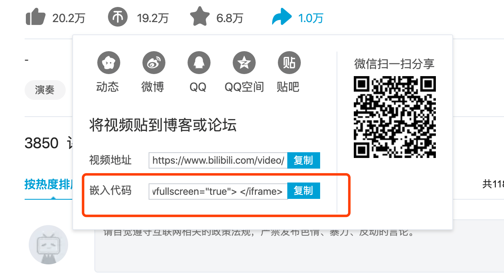
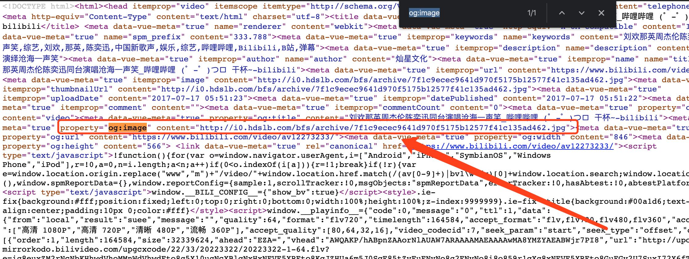
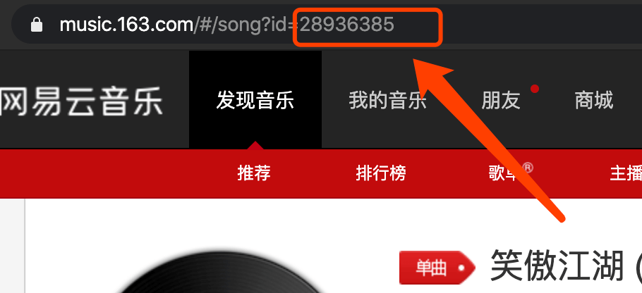

# 《笑傲江湖》歌曲大集合

数据来源：B 站 & 网易云音乐

## 贡献歌曲

数据均放在代码文件`src/assets/data.json`中

### B 站

从拿到的分享代码中，抽取**aid,bvid,cid**对应的值，新增到`data.json`文件内，`title`字段自己填个有意义的即可。

封面图地址的获取：

### 网易云音乐

只需要把网址中的**id**值填入即可。
